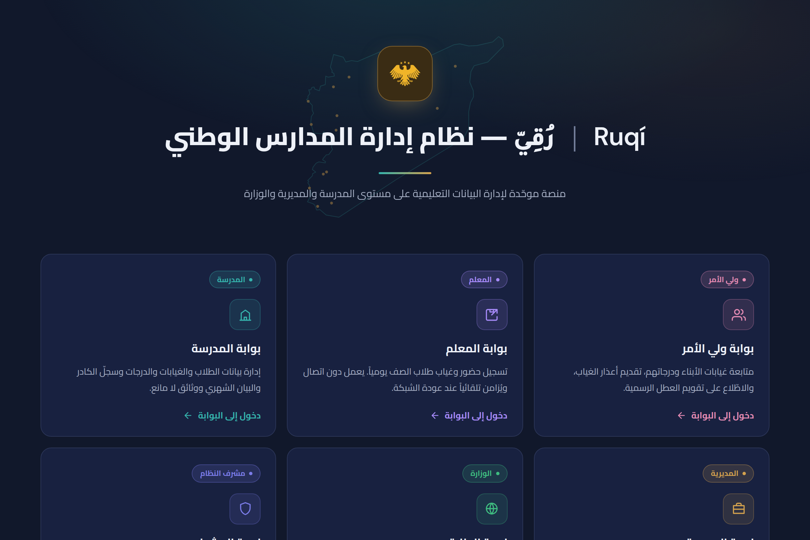
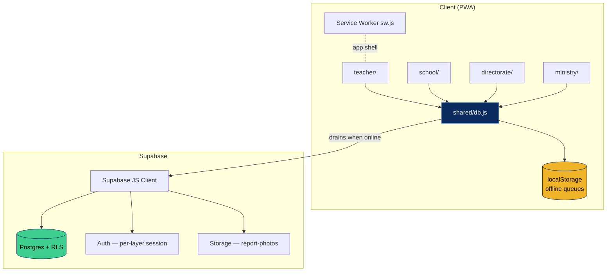

# NSAMS — النظام الوطني لإدارة المدارس

> An offline-first, Arabic (RTL) PWA that connects the four tiers of a national school system — **teacher → school → directorate → ministry** — around one shared source of truth for daily attendance and field reports. Built with vanilla JS, no framework, no build step, on top of Supabase.

<p align="center">
  
  <!-- TODO: add docs/screenshots/splash.png -->
</p>

<p align="center">
  <a href="LICENSE"></a>
  <a href="#"></a>
  <a href="#"></a>
  <a href="#"></a>
</p>

---

## 📑 Table of contents

- [What it is](#-what-it-is)
- [The four portals](#-the-four-portals)
- [Screenshots](#-screenshots)
- [Tech stack & decisions](#-tech-stack--decisions)
- [Architecture at a glance](#-architecture-at-a-glance)
- [Running it locally](#-running-it-locally)
- [Point it at your own Supabase backend](#-point-it-at-your-own-supabase-backend)
- [Project structure](#-project-structure)
- [Deployment](#-deployment)
- [License](#-license)

---

## 🎯 What it is

NSAMS (النظام الوطني لإدارة المدارس) is a single installable web app that replaces the paper registers, phone calls, and spreadsheets used to track **who showed up to school today** — students and teachers alike — and to escalate urgent field reports up the chain of command.

It is **multi-page by design**: a small landing page routes each kind of user into a dedicated portal, and every portal shares one data-access layer (`shared/db.js`) and one Supabase backend.

**Core capabilities**

- 🧑‍🏫 **Teacher** — record per-class student attendance, offline-first, with a 24-hour cached roster and a per-class absence log.
- 🏫 **School** — manage students, classes and teacher assignments; see the school's daily attendance and submit emergency/field reports (with photos).
- 🗂️ **Directorate** — monitor every school in the region on a live map, with red/amber/green status, daily summaries, and the region's report inbox.
- 🏛️ **Ministry** — a national roll-up: governorate-level attendance indicators and totals.

**Platform features**

- 🌍 **Arabic-first, RTL** UI (Cairo font), Syria-timezone aware date handling.
- 📡 **Offline-first:** attendance and reports are written to a local queue first and synced to Supabase when the connection returns — nothing is lost on a dropped link.
- 🗺️ **Live directorate map** via Leaflet + OpenStreetMap tiles.
- 📲 **Installable PWA** with a Service Worker app shell (`nsams-v1`) and a separate auth session per portal.
- 🔐 **Auth:** Supabase email/password, with per-layer session storage so a school login and a directorate login can coexist on one device.

---

## 🧭 The four portals

| Portal | Path | Who it's for | What it does |
|---|---|---|---|
| **Teacher** | `/teacher/` | Class teachers | Submit daily student attendance per class; works fully offline and syncs later. Precached by the Service Worker for field use. |
| **School** | `/school/` | School admins | Students, classes, teacher-to-class assignments, daily attendance status, and emergency report submission with photo upload. |
| **Directorate** | `/directorate/` | Governorate education offices | Map + dashboard of all schools in the directorate: attendance status, today's summary, and the regional report inbox (open / acknowledged / resolved). |
| **Ministry** | `/ministry/` | Ministry of Education | National dashboard: per-governorate attendance summary and aggregate counts. |

The root `index.html` is just the launcher that links to the four portals.

---

## 📸 Screenshots

> <!-- TODO: drop real images into screenshots/ and docs/screenshots/ — placeholders are committed empty -->

<table>
  <tr>
    <td></td>
    <td></td>
    <td></td>
  </tr>
  <tr>
    <td align="center"><sub>Teacher — class attendance</sub></td>
    <td align="center"><sub>School — daily attendance</sub></td>
    <td align="center"><sub>School — field reports</sub></td>
  </tr>
  <tr>
    <td></td>
    <td></td>
    <td></td>
  </tr>
  <tr>
    <td align="center"><sub>Directorate — overview</sub></td>
    <td align="center"><sub>Directorate — live map</sub></td>
    <td align="center"><sub>Ministry — national dashboard</sub></td>
  </tr>
</table>

---

## 🛠 Tech stack & decisions

| Layer | Choice | Why |
|---|---|---|
| **Frontend** | Vanilla JS, one folder per portal | No build step → instant deploy, no toolchain to maintain. Each portal is a small static page that imports the shared data layer. |
| **Shared data layer** | `shared/db.js` (ES module) | A single place where Supabase calls, auth, the offline queues, and the cross-tier aggregations live. Every portal imports it. |
| **Styling** | Hand-written CSS with custom properties | Every design token (`--navy`, `--accent`, `--gold`, …) flows from `:root`. |
| **Backend** | [Supabase](https://supabase.com) (Postgres + Auth + Storage) | RLS enforces who can see which school/directorate in SQL, where it belongs. The JS client is one CDN script tag. |
| **Offline** | `localStorage` FIFO queues drained on reconnect | Every attendance/report mutation writes locally first, then enqueues a Supabase op that drains when `navigator.onLine` returns. |
| **Map** | Leaflet + OpenStreetMap | The directorate view plots school status geographically. |
| **PWA** | Hand-rolled `sw.js` + `manifest.json` | Network-first for navigations (fresh data when online), stale-while-revalidate for static assets, root shell as the offline fallback. |
| **Auth** | Supabase email/password, per-layer `storageKey` | `nsams-auth-<layer>` keeps each portal's session isolated on a shared device. |
| **CI/CD** | GitHub Actions | JS syntax + HTML validation across all pages, manifest sanity, cache-version check, Lighthouse budget, and GitHub Pages deploy. |

### Theme colors

`#0B2B5E` navy · `#2F80ED` accent blue · `#F0B429` gold · `#0d1e3a` surface.

---

## 🏗 Architecture at a glance

A full deep-dive — the offline sync model, per-tier aggregation, the data-access layer, the threat model, and the trade-offs — lives in **[docs/ARCHITECTURE.md](docs/ARCHITECTURE.md)**. The short version:



**The data-flow model in three sentences:**

1. A teacher/school user records attendance or a report; it is written to a `localStorage` queue immediately, so the UI is correct whether or not there's a network.
2. When online, the queue drains to Supabase (`daily_attendance`, student attendance, reports + `report-photos` storage); failed items stay queued and retry on the next `online` event.
3. Directorate and ministry portals read **aggregations** of that same data (today's summary, per-school status, governorate roll-ups) through the shared layer.

---

## 🚀 Running it locally

```bash
git clone https://github.com/andrewleko19-boop/nsams.git
cd nsams

# Serve over a real origin (Service Workers + Supabase auth won't work from file://)
npx serve .
# or
python3 -m http.server 8000
```

Then open `http://localhost:8000` and pick a portal.

### Local checks (same as CI)

```bash
npm install            # one-time, installs the dev tooling
npm run check          # JS syntax + HTML validation + version + manifest
npm run check:js       # JS syntax only (all pages + modules)
npm run check:html     # html-validate all five pages
npm run check:versions # Service Worker cache-version sanity
npm run check:manifest # PWA manifest sanity
npm run lighthouse     # Full Lighthouse audit (needs Chrome installed)
```

See **[SETUP.md](SETUP.md)** for wiring up GitHub Actions + Pages.

---

## 🗄 Point it at your own Supabase backend

The app talks to a hosted Supabase project. To run your own:

1. Create a project at https://supabase.com (free tier is enough).
2. Run `nsams_database_schema.sql` against your project (SQL Editor) to create the tables, RLS policies, RPCs, and the `report-photos` storage bucket.
   > The SQL schema is maintained separately and is **not** committed here.
3. Enable **Email** auth under Authentication → Providers and set your Site URL + redirect URLs.
4. In `shared/db.js`, replace `SUPABASE_URL` and `SUPABASE_ANON_KEY` with your project's values.

The anon key is safe to ship — RLS enforces all access control server-side.

---

## 📁 Project structure

```
nsams/
├── index.html                 # Landing page — links to the four portals
├── manifest.json              # PWA manifest (theme, icons, display: standalone)
├── sw.js                      # Service Worker (network-first nav, SWR assets, nsams-v1)
├── shared/
│   └── db.js                  # Shared data layer: Supabase + auth + offline queues + aggregations
├── teacher/                   # Teacher portal (index.html / script.js / style.css)
├── school/                    # School portal
├── directorate/               # Directorate portal (+ Leaflet map)
├── ministry/                  # Ministry portal
├── icons/                     # PWA icons (added separately)
├── tools/                     # CI checks: js-syntax, manifest, versions
├── .github/workflows/         # CI, deploy, Lighthouse
└── docs/
    ├── ARCHITECTURE.md        # Deep-dive: sync, aggregation, RLS, threat model
    └── screenshots/
```

> `nsams_database_schema.sql` (tables + RLS + RPCs + storage policies) is maintained outside this repository.

---

## 🚢 Deployment

Push to `main` → the **Deploy** workflow re-validates and publishes the whole site (landing + all portals) to GitHub Pages.

> ⚠️ When you change any cached shell file, **bump `CACHE` in `sw.js`** (`nsams-v1` → `nsams-v2`, …). The Service Worker only purges old caches when the key changes; CI's `check:versions` enforces the `nsams-v<number>` shape. Forget, and returning users keep the old shell.

After deploy, test on the live URL: DevTools → Application → Clear site data → unregister the Service Worker → hard reload.

---

## 📄 License

Proprietary — see [`LICENSE`](LICENSE). © 2026 Mohamed Hassan. All rights reserved.

---

## 👨‍💻 Author

**Mohamed Hassan** · 🐙 [@andrewleko19-boop](https://github.com/andrewleko19-boop)
