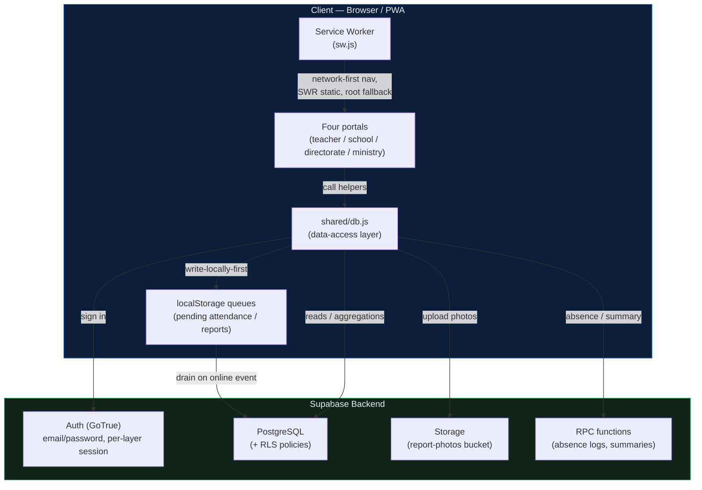
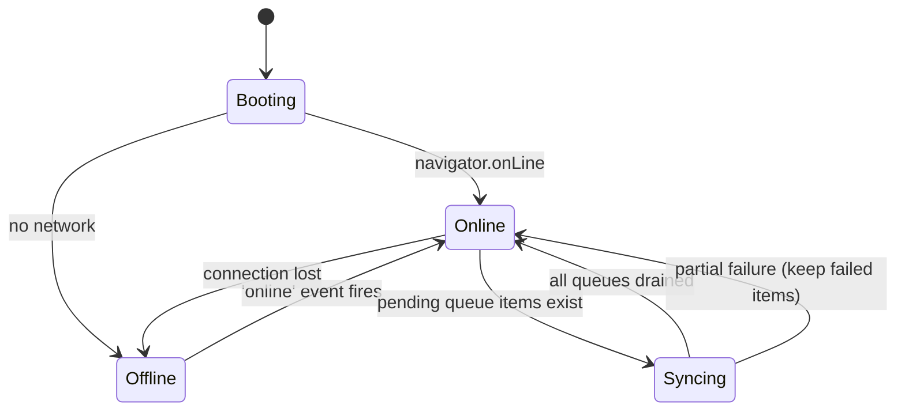

# NSAMS — Architecture Deep Dive

> A technical internals guide to NSAMS: the multi-portal layout, the shared data-access layer, the offline-first sync model for attendance and field reports, how each tier aggregates the same underlying data, the security model, and the trade-offs worth defending. Written for any engineer — or future me — who needs to understand *why* things are built the way they are.

---

## Table of Contents

1. [Project Overview](#1-project-overview)
2. [System Architecture Diagram](#2-system-architecture-diagram)
3. [Tech Stack](#3-tech-stack)
4. [Why Supabase?](#4-why-supabase)
5. [The Shared Data Layer (`shared/db.js`)](#5-the-shared-data-layer-shareddbjs)
6. [Offline Sync — How It Actually Works](#6-offline-sync--how-it-actually-works)
7. [Per-Tier Aggregation](#7-per-tier-aggregation)
8. [Auth & Per-Layer Sessions](#8-auth--per-layer-sessions)
9. [The Service Worker](#9-the-service-worker)
10. [Security Model](#10-security-model)
11. [Scale Boundaries](#11-scale-boundaries)
12. [Trade-offs & What I'd Revisit](#12-trade-offs--what-id-revisit)
13. [Useful Links](#13-useful-links)

---

## 1. Project Overview

**NSAMS** (النظام الوطني لإدارة المدارس) is a Progressive Web App built to track daily school attendance — students and teachers — and to escalate field reports across the four tiers of a national education system: **teacher → school → directorate → ministry**.

| Property | Value |
|---|---|
| Type | Multi-page PWA — one landing page + four role portals |
| Codebase | Vanilla HTML/CSS/JS per portal + one shared ES module |
| Backend | Supabase (PostgreSQL + Auth + Storage) |
| Offline | `localStorage` FIFO queues drained on reconnect |
| Auth | Supabase email/password, **per-layer** session storage |
| Map | Leaflet + OpenStreetMap (directorate portal) |
| Deployment | GitHub Pages (static) |
| Language | Arabic-first, RTL (Cairo) |
| Developer | Mohamed Hassan |

### Why multi-page instead of single-file?

The four audiences have almost no UI overlap — a teacher submitting attendance and a ministry analyst reading a national roll-up share *data*, not screens. Splitting by portal keeps each page small and independently cacheable, while a single shared module (`shared/db.js`) prevents the data logic from forking. The root `index.html` is a thin launcher.

### Project Structure

```
nsams/
├── index.html          # Launcher → links to the four portals
├── sw.js               # Service Worker: network-first nav, SWR assets (nsams-v1)
├── manifest.json       # PWA manifest (theme, icons, display: standalone)
├── shared/
│   └── db.js           # The data layer — Supabase, auth, queues, aggregations
├── teacher/            # index.html / script.js / style.css
├── school/
├── directorate/        # + Leaflet map
├── ministry/
├── icons/              # PWA icons (added separately)
└── docs/
    └── ARCHITECTURE.md # This document
```

> `nsams_database_schema.sql` — tables, RLS policies, RPC bodies, and storage-bucket policies — is maintained outside this repository.

---

## 2. System Architecture Diagram



### Offline State Machine



---

## 3. Tech Stack

### Frontend

| Layer | Choice | Reason |
|---|---|---|
| Language | Vanilla JavaScript (ES modules) | No build step; each portal is static HTML that imports `shared/db.js` |
| Styling | CSS custom properties | Every token flows from `:root`; consistent navy/accent/gold theme |
| Offline storage | `localStorage` JSON queues | Simple, synchronous, survives reloads; enough for the queue sizes involved |
| Map | Leaflet + OpenStreetMap tiles | Geographic school-status view in the directorate portal |
| PWA runtime | Service Worker (`sw.js`) | Network-first navigations, stale-while-revalidate static, root shell offline fallback |
| PWA manifest | `manifest.json` | Install / "Add to Home Screen", standalone display |

### Backend (Supabase)

| Service | Usage |
|---|---|
| PostgreSQL | Schools, directorates/governorates, classes, students, teachers, `daily_attendance`, student attendance, reports |
| Row-Level Security | Authorization — a school sees its own data, a directorate its region, enforced in SQL |
| Supabase Auth (GoTrue) | Email/password sign-in; **per-layer** session storage key (`nsams-auth-<layer>`) |
| Supabase Storage | `report-photos` bucket for emergency/field report images |
| RPC functions | Server-side aggregations (e.g. per-class absence log, summaries) |

---

## 4. Why Supabase?

A national-attendance app is *inherently relational* — a student belongs to a class, a class to a school, a school to a directorate, a directorate to a governorate, and attendance rows hang off all of them. Postgres + JOINs express the per-tier roll-ups directly; RLS lets each tier see exactly its slice without app-level permission code; and the JS client is a single CDN script tag with Auth and Storage bundled in. Supabase is also standard open-source Postgres underneath, so the data is never trapped behind a proprietary query language.

---

## 5. The Shared Data Layer (`shared/db.js`)

Every portal imports the same ES module. It is the single seam between the UI and Supabase, which is what stops four portals from drifting into four incompatible data dialects.

The Supabase client is created once, with a **per-layer** auth `storageKey` derived from the URL path:

```js
const LAYER = location.pathname.split('/').filter(Boolean).find(
  s => ['school', 'teacher', 'directorate', 'ministry'].includes(s)
) || 'root';

const db = createClient(SUPABASE_URL, SUPABASE_ANON_KEY, {
  auth: { storageKey: `nsams-auth-${LAYER}`, persistSession: true, autoRefreshToken: true, detectSessionInUrl: true },
});
```

The module groups its exports by tier:

- **Auth** — `login`, `logout`, `getCurrentUser` (resolves role, `school_id`, `directorate_id`, `full_name`).
- **Teacher** — `getTeacherClasses`, `getClassStudents` (24-hour cached roster), `getClassAttendanceForDate`, `getClassAbsenceLog` (RPC), `getClassSubmissionStatus`.
- **School** — `getSchoolClasses`, `getTeachersBySchool`, `assignTeacherToClass`, `removeTeacherFromClass`, `hasTodayAttendance`, `saveAttendance`, `submitReport`.
- **Directorate** — `getTodaySummary`, `getSchoolsAttendanceStatus` (red/amber/green), `getReportsForDirectorate`, `updateReportStatus`.
- **Ministry** — `getMinistryAttendanceSummary`, `getGovernoratesCount`.
- **Utilities** — `getAcademicYear`, `localDateISO` (forces device-timezone dates, not UTC — important for Syria UTC+3 so "today" is correct), `gradeNameAr`, and `syncPendingV2` (drains the queues).

---

## 6. Offline Sync — How It Actually Works

**Scenario: a teacher records attendance, or a school files a report, with no connection.**

The model is deliberately simple: write locally first, queue the server op, drain on reconnect. There are three independent queues, each a JSON array in `localStorage`:

```js
const QUEUE_ATTENDANCE = "nsams_pending_attendance";  // school-level daily attendance
const QUEUE_REPORTS    = "nsams_pending_reports";     // emergency / field reports
const QUEUE_STU_ATT    = "nsams_pending_stu_att";     // per-student class attendance
```

### Step 1 — write locally, return immediately

Each mutation pushes an op descriptor onto its queue and returns. The UI has already updated, so it's correct regardless of connectivity. A report also gets a client-generated **receipt number** (`RPT-<ts>-<rand>`) up front, so the user has something to reference even before the row reaches the server.

### Step 2 — reconnection drains the queues

`syncPendingV2()` walks all three queues and replays each op against Supabase. It's invoked on boot and on the browser's `online` event.

### Step 3 — failure handling

An op that fails stays in its queue and is retried on the next drain; a single failure doesn't block the rest. This is "retry on next connectivity event," not timed backoff — sufficient and predictable for the real workload (a handful of queued rows after a Wi-Fi blip in a school with patchy coverage).

### Report photos

Report images arrive from the UI as `data:` URIs. Rather than store multi-MB base64 inside a table row, `uploadDataUri` pushes the bytes to the `report-photos` Storage bucket and keeps only the public URL. **Safe fallback:** if the bucket is missing or the upload fails, the original data URI is kept rather than dropping the photo — no silent data loss.

---

## 7. Per-Tier Aggregation

The same attendance rows are read very differently as you go up the hierarchy. All of this lives in `shared/db.js` so the aggregation logic has one home:

| Tier | Read | What it produces |
|---|---|---|
| Teacher | `getClassAttendanceForDate`, `getClassAbsenceLog` | One class's student attendance + cumulative absences |
| School | `getSchoolStatus`, `hasTodayAttendance` | Whether each class has submitted today; the school's daily picture |
| Directorate | `getTodaySummary`, `getSchoolsAttendanceStatus` | Teacher-presence + student-attendance roll-up, plus a per-school red/amber/green status for the map |
| Ministry | `getMinistryAttendanceSummary`, `getGovernoratesCount` | Governorate-level attendance indicators and totals |

Heavier roll-ups are pushed into Postgres RPC functions so the aggregation happens next to the data instead of shipping rows to the client.

---

## 8. Auth & Per-Layer Sessions

A single physical device (a shared school computer, say) may need to be logged into more than one portal. Because the auth `storageKey` is namespaced per layer (`nsams-auth-teacher`, `nsams-auth-school`, …), each portal keeps its own session — signing out of one does not sign out of the others. `getCurrentUser` resolves the signed-in user's role and scope (`school_id` / `directorate_id`), which the UI uses to decide what to render and which RLS-guarded reads to issue.

---

## 9. The Service Worker

`sw.js` keys its cache on `const CACHE = 'nsams-v1'` and:

- **Precaches** the known shells it can list: the root, the teacher portal (the one most likely used in the field, offline), and `shared/db.js`.
- **Navigations:** network-first → fall back to cache → fall back to the root shell. Fresh data when online; still usable when not.
- **Other same-origin GETs:** stale-while-revalidate (fast and self-updating).
- **Cross-origin** (Supabase API, Google Fonts, map tiles) is left to the network.

There is intentionally **no `skipWaiting()`** — a new SW activates only once old tabs close, which avoids serving a half-updated mix of old HTML and new JS mid-session. Bump `CACHE` on every deploy; `tools/check-versions.mjs` enforces the `nsams-v<number>` shape so a malformed key can't ship.

---

## 10. Security Model

RLS is the backbone: **authorization lives at the database layer**, so a bug in the JavaScript can't grant access the database doesn't allow. A school's queries return only that school's rows; a directorate's, only its region's.

| Threat | Defense |
|---|---|
| A school reading another school's attendance | RLS scopes reads by `school_id` tied to the signed-in user |
| A directorate reading another region's reports | RLS scopes by `directorate_id` |
| Tampering with the anon key | The anon key is public-by-design; it grants nothing RLS doesn't already allow |
| Multi-portal session bleed on a shared device | Per-layer `storageKey` isolates sessions |
| Oversized base64 photos bloating rows | Photos go to Storage; only URLs are persisted |

### Known trade-offs in v1

- **No rate limiting** on report/attendance submission — an application-level spam vector; intended mitigation is Supabase Edge Function throttling, deferred past v1.
- **Last-write-wins** on attendance upserts — two people editing the same class/day row converge on whoever wrote last; acceptable for the real workflow.

---

## 11. Scale Boundaries

Honest v1 estimates, not load-tested:

| Metric | v1 expectation | Notes |
|---|---|---|
| Schools per directorate | tens–low hundreds | Map + status grid designed around this |
| Students per class | ~20–40 | Roster cached 24h on the teacher device |
| Offline queue depth | a few to dozens of rows | A day's worth of one user's submissions |
| Concurrent users | per Supabase free/low tier | Not stress-tested |

---

## 12. Trade-offs & What I'd Revisit

- **Multi-page + one shared module was the right call.** Small per-portal pages cache and load fast on mid-range field devices, and the shared layer keeps the data logic singular. The cost is some duplicated page scaffolding, which is cheap.
- **`localStorage` queues over IndexedDB.** Simpler and synchronous; fine at the current queue sizes. If a single device ever needs to buffer thousands of rows offline, IndexedDB (with an auto-increment key for free FIFO) is the upgrade path.
- **Retry-on-reconnect, no dead-letter.** An op that fails *deterministically* retries forever. A dead-letter path that surfaces a stuck item to the user is the realistic next step.
- **LWW attendance.** Keep it, but a "this row was updated by someone else" notice driven by timestamps is a cheap, high-value addition before anything heavier.

---

## 13. Useful Links

| Resource | URL |
|---|---|
| Repository | https://github.com/andrewleko19-boop/nsams |
| Supabase Docs | https://supabase.com/docs |
| PWA Checklist | https://web.dev/pwa-checklist/ |
| RLS Guide | https://supabase.com/docs/guides/database/postgres/row-level-security |
| Leaflet | https://leafletjs.com/ |

---

*Last updated: June 2026 — Mohamed Hassan*
